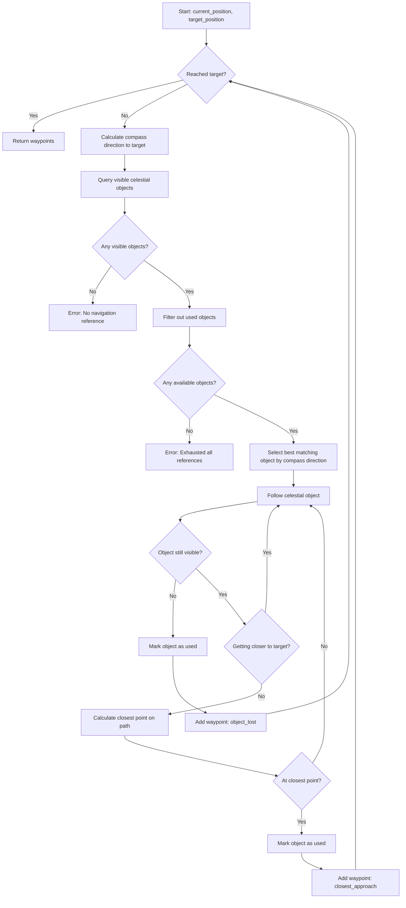

# Celestial Compass Navigation Algorithm

## Overview

A pathfinding algorithm that navigates using only celestial objects as reference points. The algorithm works by iteratively selecting celestial objects that align with the compass direction to the target, following them until they're no longer useful, then selecting new reference points.

## Core Data Structures

### Position
```python
class Position:
    latitude: float      # -90 to 90 degrees
    longitude: float     # -180 to 180 degrees
    altitude: float      # meters above sea level (optional, default 0)
```

### CelestialObject
```python
class CelestialObject:
    name: str                    # e.g., "Polaris", "Venus", "Sirius"
    right_ascension: float       # hours (0-24)
    declination: float           # degrees (-90 to 90)
    magnitude: float             # brightness (lower is brighter)
    object_type: str             # "star", "planet", "moon", "sun"
    
    # Dynamic properties (calculated based on time and observer position)
    azimuth: float               # compass direction in degrees (0-360)
    altitude: float              # elevation above horizon in degrees (-90 to 90)
    is_visible: bool             # above horizon and bright enough
```

### Waypoint
```python
class Waypoint:
    position: Position
    reference_object: CelestialObject  # The celestial object used to reach this point
    reason: str                        # "target_reached", "object_lost", "closest_approach"
    timestamp: datetime
```

### NavigationState
```python
class NavigationState:
    current_position: Position
    target_position: Position
    used_objects: Set[str]       # Names of celestial objects already used (don't reuse)
    waypoints: List[Waypoint]    # Path taken so far
    iteration_count: int         # Safety limit for iterations
```

## Algorithm Flow



## Step-by-Step Algorithm

### Step 1: Calculate Compass Direction

```python
function calculate_compass_direction(from_pos: Position, to_pos: Position) -> float:
    """
    Calculate the compass bearing from 'from_pos' to 'to_pos'.
    Returns bearing in degrees (0-360), where 0 = North, 90 = East, etc.
    """
    lat1 = radians(from_pos.latitude)
    lat2 = radians(to_pos.latitude)
    delta_lon = radians(to_pos.longitude - from_pos.longitude)
    
    x = sin(delta_lon) * cos(lat2)
    y = cos(lat1) * sin(lat2) - sin(lat1) * cos(lat2) * cos(delta_lon)
    
    bearing = degrees(atan2(x, y))
    return (bearing + 360) % 360  # Normalize to 0-360
```

### Step 2: Query Visible Celestial Objects

```python
function get_visible_celestial_objects(
    observer_pos: Position,
    observation_time: datetime,
    used_objects: Set[str]
) -> List[CelestialObject]:
    """
    Get all celestial objects visible from the observer's position at the given time.
    Excludes objects that have already been used.
    """
    all_objects = query_celestial_catalog()  # Stars, planets, etc.
    visible_objects = []
    
    for obj in all_objects:
        if obj.name in used_objects:
            continue  # Skip already used objects
            
        # Calculate azimuth and altitude for this observer/time
        obj.azimuth, obj.altitude = calculate_horizontal_coordinates(
            obj, observer_pos, observation_time
        )
        
        # Object is visible if above horizon and bright enough
        if obj.altitude > 0 and obj.magnitude < 6.0:
            obj.is_visible = True
            visible_objects.append(obj)
    
    return visible_objects
```

### Step 3: Select Best Matching Celestial Object

```python
function select_best_celestial_object(
    target_bearing: float,
    visible_objects: List[CelestialObject]
) -> CelestialObject:
    """
    Select the visible celestial object whose azimuth is closest to the target bearing.
    Uses circular distance to handle the 0/360 degree wraparound.
    """
    best_object = None
    min_angular_distance = 360.0
    
    for obj in visible_objects:
        # Calculate circular distance (handles 0/360 wraparound)
        diff = abs(obj.azimuth - target_bearing)
        angular_distance = min(diff, 360 - diff)
        
        if angular_distance < min_angular_distance:
            min_angular_distance = angular_distance
            best_object = obj
    
    return best_object
```

### Step 4: Follow Celestial Object

```python
function follow_celestial_object(
    nav_state: NavigationState,
    reference_object: CelestialObject,
    step_size_km: float = 10.0
) -> Tuple[Position, str]:
    """
    Follow the reference celestial object until:
    1. The object is no longer visible (below horizon)
    2. We've reached the closest point to the target following this object
    
    Returns: (final_position, reason_for_stopping)
    """
    current_pos = nav_state.current_position
    target_pos = nav_state.target_position
    
    # Track distance to target to detect when we start moving away
    previous_distance = haversine_distance(current_pos, target_pos)
    closest_point = current_pos
    closest_distance = previous_distance
    
    while True:
        # Move toward the reference object (follow it)
        # We move in the direction of the object's current azimuth
        next_pos = move_in_direction(current_pos, reference_object.azimuth, step_size_km)
        
        # Update object position for new location
        reference_object.azimuth, reference_object.altitude = calculate_horizontal_coordinates(
            reference_object, next_pos, datetime.now()
        )
        
        # Check 1: Is object still visible?
        if reference_object.altitude <= 0:
            return current_pos, "object_lost"
        
        # Check 2: Calculate new distance to target
        current_distance = haversine_distance(next_pos, target_pos)
        
        # Check 3: Have we reached the closest point to target?
        if current_distance > previous_distance:
            # We're moving away from target - return the closest point
            return closest_point, "closest_approach"
        
        # Update tracking
        if current_distance < closest_distance:
            closest_distance = current_distance
            closest_point = next_pos
        
        previous_distance = current_distance
        current_pos = next_pos
        
        # Check 4: Have we reached the target?
        if current_distance < step_size_km:
            return next_pos, "target_reached"
```

### Step 5: Main Navigation Loop

```python
function navigate_by_celestial_objects(
    start_position: Position,
    target_position: Position,
    max_iterations: int = 100
) -> List[Waypoint]:
    """
    Main navigation algorithm using celestial objects as reference points.
    """
    # Initialize navigation state
    nav_state = NavigationState(
        current_position=start_position,
        target_position=target_position,
        used_objects=set(),
        waypoints=[],
        iteration_count=0
    )
    
    while nav_state.iteration_count < max_iterations:
        # Check if we've reached the target
        if positions_equal(nav_state.current_position, target_position, tolerance=0.1):
            nav_state.waypoints.append(Waypoint(
                position=nav_state.current_position,
                reference_object=None,
                reason="target_reached",
                timestamp=datetime.now()
            ))
            return nav_state.waypoints
        
        # Step 1: Calculate compass direction to target
        target_bearing = calculate_compass_direction(
            nav_state.current_position,
            nav_state.target_position
        )
        
        # Step 2: Get visible celestial objects
        visible_objects = get_visible_celestial_objects(
            nav_state.current_position,
            datetime.now(),
            nav_state.used_objects
        )
        
        if not visible_objects:
            raise NavigationError("No visible celestial objects available for navigation")
        
        # Step 3: Select best matching object
        best_object = select_best_celestial_object(target_bearing, visible_objects)
        
        if not best_object:
            raise NavigationError("Could not find suitable celestial reference")
        
        # Step 4: Follow the celestial object
        final_pos, reason = follow_celestial_object(nav_state, best_object)
        
        # Step 5: Record waypoint and update state
        nav_state.waypoints.append(Waypoint(
            position=final_pos,
            reference_object=best_object,
            reason=reason,
            timestamp=datetime.now()
        ))
        
        # Mark object as used (don't use it again)
        nav_state.used_objects.add(best_object.name)
        
        # Update current position
        nav_state.current_position = final_pos
        nav_state.iteration_count += 1
    
    raise NavigationError(f"Exceeded maximum iterations ({max_iterations})")
```

## Helper Functions

### Haversine Distance
```python
function haversine_distance(pos1: Position, pos2: Position) -> float:
    """Calculate great-circle distance between two positions in kilometers."""
    R = 6371  # Earth's radius in km
    
    lat1, lon1 = radians(pos1.latitude), radians(pos1.longitude)
    lat2, lon2 = radians(pos2.latitude), radians(pos2.longitude)
    
    dlat = lat2 - lat1
    dlon = lon2 - lon1
    
    a = sin(dlat/2)**2 + cos(lat1) * cos(lat2) * sin(dlon/2)**2
    c = 2 * atan2(sqrt(a), sqrt(1-a))
    
    return R * c
```

### Move in Direction
```python
function move_in_direction(
    position: Position,
    bearing_degrees: float,
    distance_km: float
) -> Position:
    """Calculate new position after moving 'distance_km' in 'bearing_degrees' direction."""
    R = 6371  # Earth's radius in km
    
    lat1 = radians(position.latitude)
    lon1 = radians(position.longitude)
    bearing = radians(bearing_degrees)
    angular_distance = distance_km / R
    
    lat2 = asin(
        sin(lat1) * cos(angular_distance) +
        cos(lat1) * sin(angular_distance) * cos(bearing)
    )
    
    lon2 = lon1 + atan2(
        sin(bearing) * sin(angular_distance) * cos(lat1),
        cos(angular_distance) - sin(lat1) * sin(lat2)
    )
    
    return Position(
        latitude=degrees(lat2),
        longitude=degrees(lon2),
        altitude=position.altitude
    )
```

### Calculate Horizontal Coordinates
```python
function calculate_horizontal_coordinates(
    celestial_obj: CelestialObject,
    observer_pos: Position,
    observation_time: datetime
) -> Tuple[float, float]:
    """
    Convert celestial coordinates (RA, Dec) to horizontal coordinates (azimuth, altitude).
    Returns: (azimuth_degrees, altitude_degrees)
    """
    # Convert observation time to Local Sidereal Time (LST)
    lst = calculate_local_sidereal_time(observer_pos.longitude, observation_time)
    
    # Hour angle
    ha = lst - celestial_obj.right_ascension
    ha_rad = radians(ha * 15)  # Convert hours to degrees, then to radians
    
    lat_rad = radians(observer_pos.latitude)
    dec_rad = radians(celestial_obj.declination)
    
    # Calculate altitude
    sin_alt = sin(dec_rad) * sin(lat_rad) + cos(dec_rad) * cos(lat_rad) * cos(ha_rad)
    altitude = degrees(asin(sin_alt))
    
    # Calculate azimuth
    cos_az = (sin(dec_rad) - sin(lat_rad) * sin_alt) / (cos(lat_rad) * cos(asin(sin_alt)))
    # Clamp to valid range to handle numerical errors
    cos_az = max(-1.0, min(1.0, cos_az))
    azimuth = degrees(acos(cos_az))
    
    # Determine correct quadrant for azimuth
    sin_az = -cos(dec_rad) * sin(ha_rad) / cos(radians(altitude))
    if sin_az < 0:
        azimuth = 360 - azimuth
    
    return azimuth, altitude
```

## Edge Cases and Error Handling

### 1. No Visible Objects
- **Scenario**: Nighttime with heavy cloud cover or observer in a deep valley
- **Solution**: Raise `NavigationError` with descriptive message
- **Alternative**: Wait for time to pass (celestial objects move) or use fallback to magnetic compass

### 2. Target Not Reachable
- **Scenario**: Target is on the opposite side of the Earth, and no combination of celestial objects provides a path
- **Solution**: Set reasonable `max_iterations` limit and raise error if exceeded
- **Alternative**: Allow "teleport" to antipodal point and continue

### 3. Object Sets Too Quickly
- **Scenario**: Following a celestial object that sets below horizon very quickly
- **Solution**: The `follow_celestial_object` function will detect this and return with "object_lost" reason
- **Result**: Algorithm will select a new object from the new position

### 4. Oscillation Between Two Points
- **Scenario**: Two celestial objects cause the algorithm to bounce back and forth
- **Solution**: The `used_objects` set prevents reusing objects, forcing progress
- **Additional**: Track visited positions to detect cycles

### 5. Polar Regions
- **Scenario**: Near poles, compass directions become unstable
- **Solution**: Use great-circle navigation instead of compass bearings in polar regions (latitude > 85°)

### 6. Time Progression
- **Scenario**: Long journeys where celestial object positions change significantly
- **Solution**: Recalculate object positions at each step using current time
- **Note**: Include time estimate for each leg to update observation time

## Example Usage

```python
# Define start and target
start = Position(latitude=52.5200, longitude=13.4050, altitude=0)  # Berlin
target = Position(latitude=48.1351, longitude=11.5820, altitude=0)  # Munich

# Navigate
try:
    waypoints = navigate_by_celestial_objects(start, target)
    
    print(f"Navigation successful! {len(waypoints)} waypoints:")
    for i, wp in enumerate(waypoints):
        obj_name = wp.reference_object.name if wp.reference_object else "N/A"
        print(f"  {i+1}. {wp.position.latitude:.4f}, {wp.position.longitude:.4f} "
              f"via {obj_name} ({wp.reason})")
              
except NavigationError as e:
    print(f"Navigation failed: {e}")
```

## Advantages of This Algorithm

1. **No Electronic Dependencies**: Works without GPS, magnetometers, or radio signals
2. **Global Coverage**: Works anywhere on Earth (with clear sky)
3. **Self-Correcting**: Each iteration refines the path based on current position
4. **Deterministic**: Same inputs always produce same outputs
5. **Simple Mental Model**: Navigators can understand "follow that star"

## Limitations

1. **Weather Dependent**: Requires clear sky visibility
2. **Time Dependent**: Different times of day/night yield different paths
3. **Not Optimal**: Path may be longer than great-circle route
4. **Celestial Object Availability**: Limited objects in some directions
5. **Daytime Navigation**: Sun is primary (often only) daytime option
